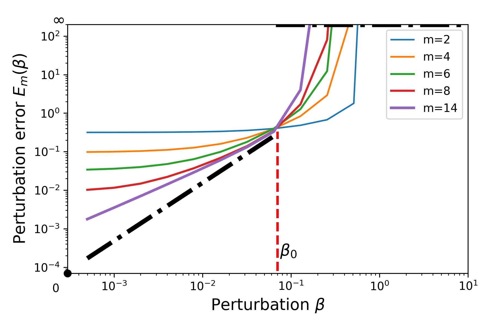
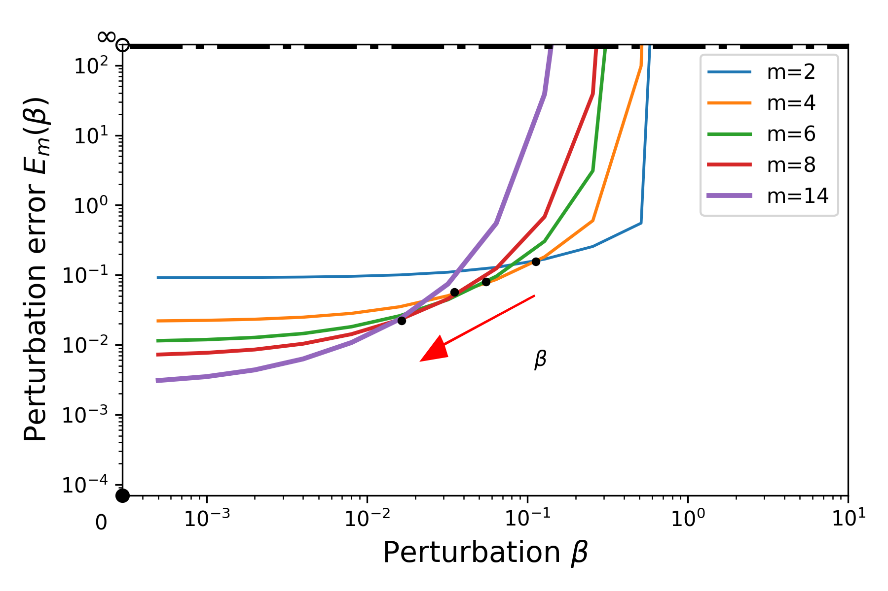
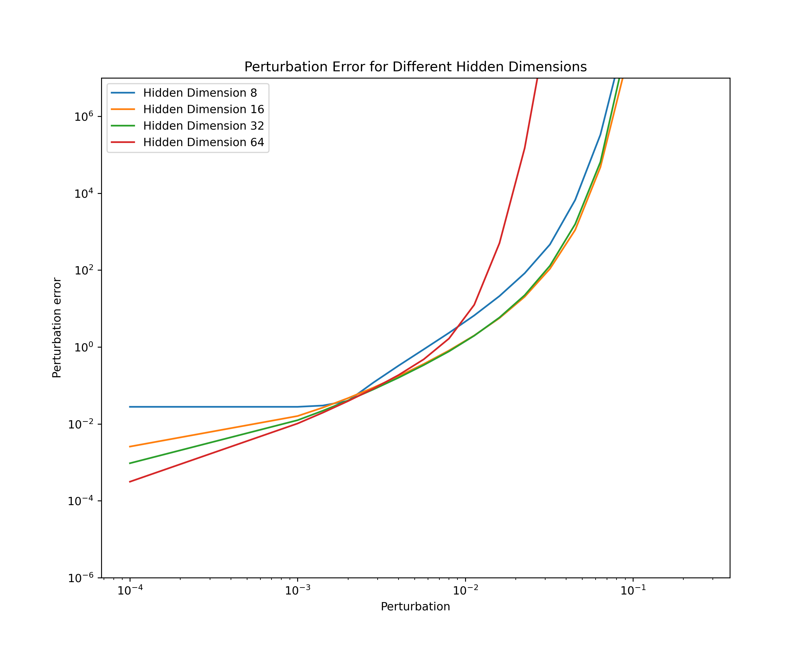

<div align="center">

# Inverse Approximation Theory for Nonlinear Recurrent Neural Networks

<a href="https://pytorch.org/get-started/locally/"></a>
<a href="https://pytorchlightning.ai/"></a>
<a href="https://hydra.cc/"></a>
<a href="https://github.com/ashleve/lightning-hydra-template"></a><br>
[](https://arxiv.org/abs/2305.19190)

<!-- [](https://papers.nips.cc/paper/2020) -->

</div>

## Description

In this paper, we study the curse of memory phenomenon of RNNs in sequence modelling.

It is shown that, simply adding nonlinear activation such as hardtanh and tanh does not relax the phenomenon.

Using stable parameterisation such as softplus parameterisation can relax the curse of memory and achieve stable approximation.

### Curse of memory in linear RNNs

Let $m$ be the hidden dimension.

| Exponential decaying memory can be stably approximated | Polynomial decaying memory cannot be stably approximated |
|:-------------------------------------------------------:|:-------------------------------------------------------:|
|  |  |


### Curse of memory in nonlinear RNNs

To add

### Proper parameterization enables stable approximation for long memory

| Parameterisation        | Exp    | Pol      |
| ----------------------- | ------ | -------- |
| Diagonal RNN            | Stable | Unstable |
| Vanilla RNN             | Stable | Unstable |
| Stable Parameterisation | Stable | Stable   |




<!--  -->

## Models

Discrete case:
$$h_{k+1} = h_k + \Delta t\sigma(Wh_k+Ux_k)$$

Continuous case:
$$\frac{dh_{t}}{dt} = \sigma(Wh_k+Ux_k)$$

The discrete case can be viewed as an Euler method for the continuous dynamical system.

## Installation

#### Pip

```bash
# clone project
git clone https://github.com/radarFudan/Curse-of-memory
cd Curse-of-memory

# [OPTIONAL] create conda environment
conda create -n myenv python=3.9
conda activate myenv

# install pytorch according to instructions
# https://pytorch.org/get-started/

# install requirements
pip install -r requirements.txt
```

#### Conda

```bash
# clone project
git clone https://github.com/radarFudan/Curse-of-memory
cd Curse-of-memory

# create conda environment and install dependencies
conda env create -f environment.yaml -n myenv

# activate conda environment
conda activate myenv
```

## How to train

```bash
python src/train.py experiment=Lf/lf-rnn.yaml
```

## Memory function evaluation

```bash
python src/memory.py experiment=Lf/lf-rnn.yaml
```

## Perturbation error evaluation

```bash
python src/perturb.py experiment=Lf/lf-rnn.yaml
```
