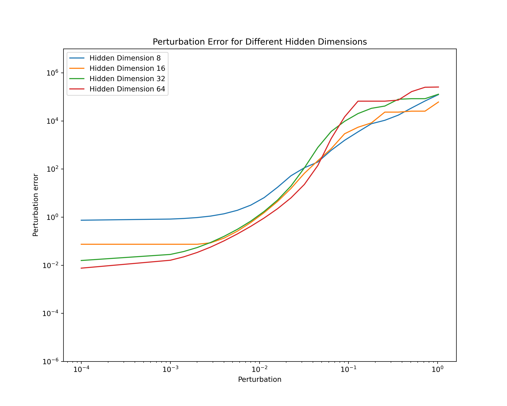
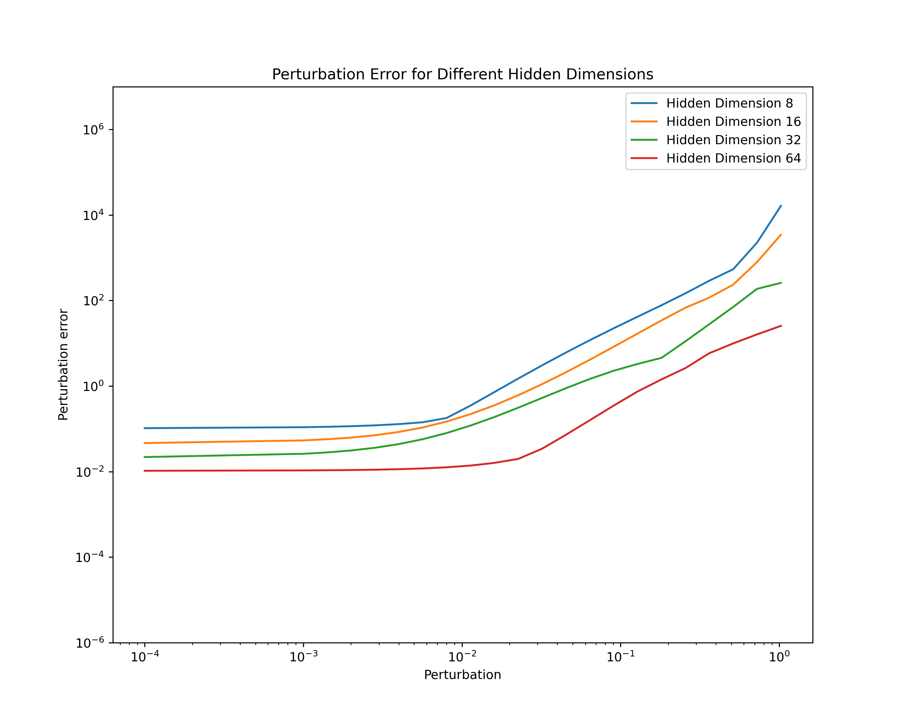

<div align="center">

# Inverse Approximation Theory for Nonlinear Recurrent Neural Networks

<a href="https://pytorch.org/get-started/locally/"></a>
<a href="https://pytorchlightning.ai/"></a>
<a href="https://hydra.cc/"></a>
<a href="https://github.com/ashleve/lightning-hydra-template"></a><br>
[](https://arxiv.org/abs/2305.19190)
<!-- [](https://papers.nips.cc/paper/2020) -->

</div>

## Description

In this paper, we study RNNs' curse of memory phenomenon.

It is shown that, simply adding nonlinear activations such as hardtanh and tanh does not relax the phenomenon.

Using stable parameterisation such as softplus parameterisation can relax the curse of memory and achieve stable approximation for long-memory.

<details>
<summary><b>Curse of memory in linear RNNs</b></summary>

Let $m$ be the hidden dimensions.
We manually construct datasets with different memory patterns.
Short-memory one is exponential decay and long-memory one is polynomial decay ($\rho_t = e^{-t}$ and $\rho_t = \frac{1}{(1+t)^p}$.)

|                      Exponential decaying memory can be stably approximated                       |                      Polynomial decaying memory cannot be stably approximated                       |
| :-----------------------------------------------------------------------------------------------: | :-------------------------------------------------------------------------------------------------: |
|  |  |
<!-- I don't know why I have to use absolute path here.  -->

</details>

<details>
<summary><b>Curse of memory in nonlinear RNNs</b></summary>

Next, we still work on the polynomial decay memory.
We show that the commonly-used activations (hardtanh and tanh) do not directly relaxed the difficuly in the polynomial decaying memory task.

| Hardtanh | Tanh |
| :---: | :---: |
|  |  |


</details>

<details>
<summary><b>Proper parameterisation enables stable approximation for long memory</b></summary>

We'll designate the parameterizations that accommodate long-term memory as stable parameterizations.

| Parameterisation        | Exponential decay    | Polynomial decay      |
| ----------------------- | ------ | -------- |
| Diagonal RNN            | Stable | Unstable |
| Vanilla RNN             | Stable | Unstable |
| Stable Parameterisation | Stable | Stable   |
| State space model       | Stable | Unstable |
| S4                      | Stable | Stable   |
| Linear Recurrent Unit   | Stable | Stable   |

| Vanilla RNN | Stable Parameterisation |
| :---: | :---: |
|  |  |


</details>

## Models

Discrete case:
$$h_{k+1} = h_k + \Delta t\sigma(Wh_k+Ux_k)$$

Continuous case:
$$\frac{dh_{t}}{dt} = \sigma(Wh_k+Ux_k)$$

The discrete case can be viewed as an Euler method for the continuous dynamical system.

## Installation

#### Pip

```bash
# clone project
git clone https://github.com/radarFudan/Curse-of-memory
cd Curse-of-memory

# [OPTIONAL] create conda environment
conda create -n myenv python=3.9
conda activate myenv

# install pytorch according to instructions
# https://pytorch.org/get-started/

# install requirements
pip install -r requirements.txt
```

#### Conda

```bash
# clone project
git clone https://github.com/radarFudan/Curse-of-memory
cd Curse-of-memory

# create conda environment and install dependencies
conda env create -f environment.yaml -n myenv

# activate conda environment
conda activate myenv
```

## How to train

```bash
python src/train.py experiment=Lf/lf-rnn.yaml
```

### Perturbation error evaluation

```bash
python src/perturb.py experiment=Lf/lf-rnn.yaml
```


## Future plan

1. Add state space model, S4, [LRU](https://arxiv.org/abs/2303.06349).
2. Add other RNN variants.
3. Current sequence length support is around 200. Improve the dataset preparation code so larger sequence length (1000+) can be tested. 

